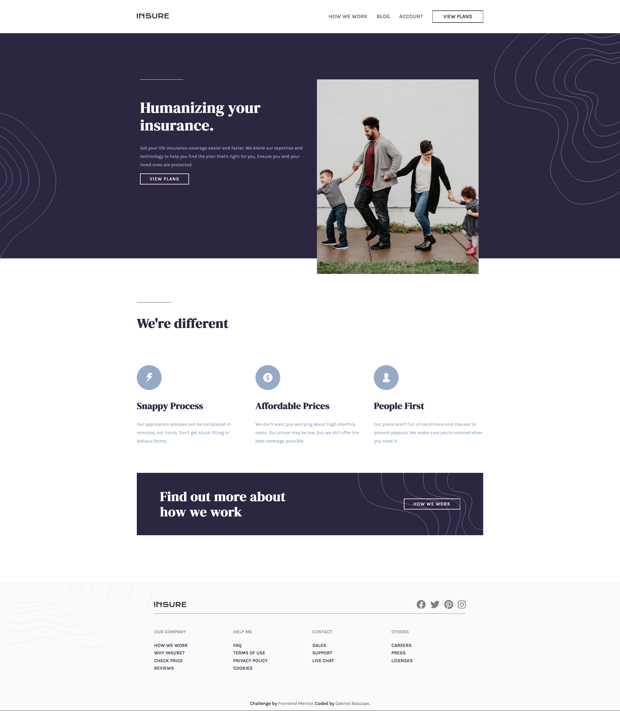
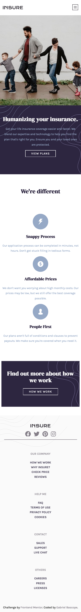

# Frontend Mentor - Insure landing page solution

This is a solution to the [Insure landing page challenge on Frontend Mentor](https://www.frontendmentor.io/challenges/insure-landing-page-uTU68JV8). Frontend Mentor challenges help you improve your coding skills by building realistic projects. 

## Table of contents

- [Overview](#overview)
  - [The challenge](#the-challenge)
  - [Screenshot](#screenshot)
  - [Links](#links)
  - [Built with](#built-with)
  - [What I learned](#what-i-learned)
  - [Continued development](#continued-development)
- [Author](#author)

**Note: Delete this note and update the table of contents based on what sections you keep.**

## Overview

### The challenge

Users should be able to:

- View the optimal layout for the site depending on their device's screen size
- See hover states for all interactive elements on the page

### Screenshot
- Desktop Preview

- Mobile Preview 

### Links

- Solution URL: [Add solution URL here](https://your-solution-url.com)
- Live Site URL: [Add live site URL here](https://your-live-site-url.com)

### Built with

- Semantic HTML5 markup
- SASS 
- Flexbox
- CSS Grid
- Normalize
- Mobile-first workflow

### What I learned
  Lately, I've been using SASS to build the projects. I feel more comfortable with it. However, It gets a little bit messy and I learned that it's important to make things clear. To make readable lines not just for me, but for other people. Also, to organize yourself in order to be more productive.  

### Continued development

After a deep consideration, I decided to focus on Js for the rest of the projects I built. I have made several projects with just HTML and CSS and I think I have a pretty good level on making simple websites. I want to make a step further.  

## Author

- Frontend Mentor - [@yourusername](https://www.frontendmentor.io/profile/Gabrielbe17/)

